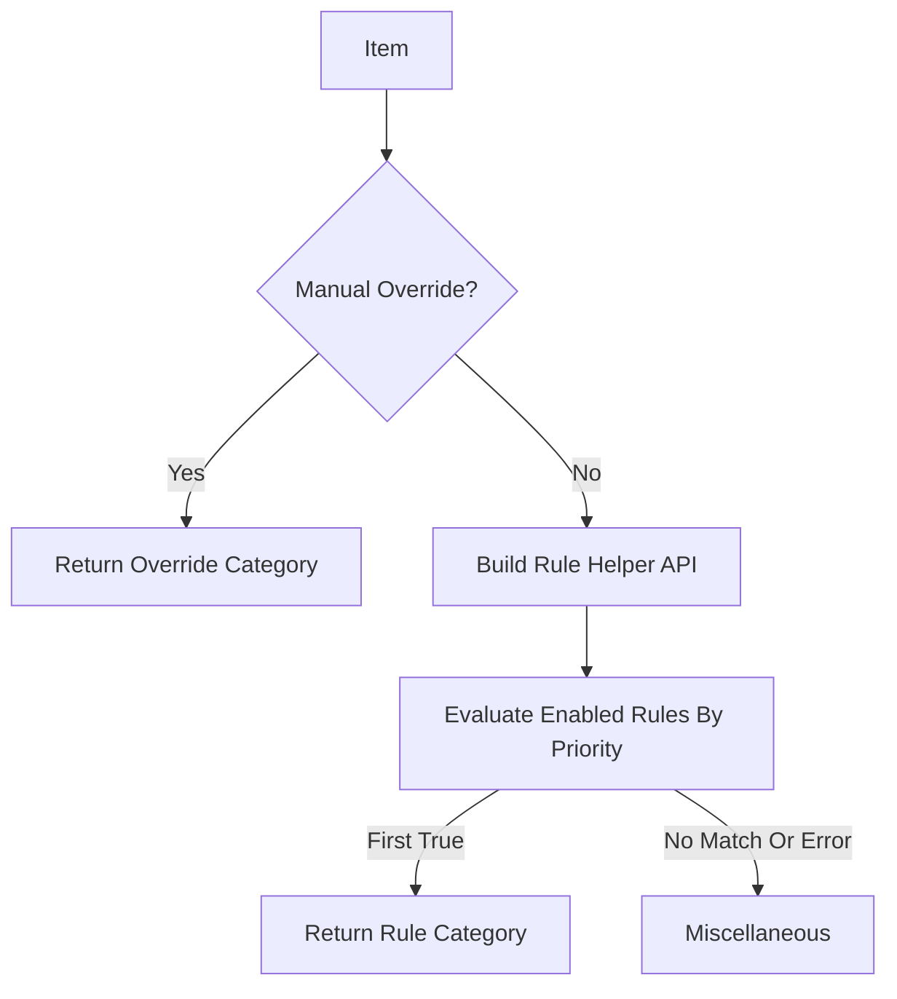

# Feature: Smart Categorization Engine

## Purpose

The Categorizer assigns items to logical categories using a priority-ordered, player-editable Lua rule pipeline. This enables AdiBags-style sectioned views with smart defaults that advanced players can reshape from the Category Editor.

## Related

- ADR: (pending)
- Code: `Omni/Categorizer.lua`

---

## Business Rules

1. Every item MUST be assigned exactly one category
2. Categories follow a strict priority pipeline (first match wins)
3. User manual overrides take highest priority
4. Categories are extensible (users can add custom categories)
5. Default categories provide "Smart Defaults" out of the box
6. Explicit item-ID registries can force items into a dedicated category before generic type-based heuristics run
7. Default category rules are editable Lua scripts stored in SavedVariables and resettable to built-in defaults
8. Editing a category supports both full Lua rule changes and exact-item include/exclude overrides

---

## Category Priority Pipeline



---

## Default Categories

| Rule Priority | Category | Default Script |
|---------------|----------|----------------|
| 17.5 | Perishable | `return perishable()` |
| 20 | Quest Items | `return questItem() or itemType("Quest")` |
| 30-35 | Ascension categories | `return ascensionCategory("Mythic+")`, etc. |
| 40 | Attunable | `return attunable()` |
| 50 | Equipment Sets | `return equipmentSet()` |
| 55 | Account Attunable | `return accountAttunable()` |
| 60 | Tools | `return toolItem()` |
| 70 | BoE | `return boe()` |
| 80 | Upgradable Items | `return upgradable()` |
| 100-180 | Fallback item-type categories | `return fallbackCategory("Equipment")`, etc. |
| 880 | Junk | `return junk()` |
| 9999 | Miscellaneous | `return true` |

Manual overrides sit above the Lua rule pipeline and always win. Visual category order is separate from rule priority, so categories can display in one order while matching in another.

### Category Rule Editing

Right-clicking a category header or category-order tile opens the Category Editor. Each category has a Lua rule script box, editable rule priority, plus `Save`, `Validate`, `Reset`, and `Enable`/`Disable` controls. Scripts use helper calls and must return `true` when the item belongs in that category:

```lua
return itemID(6948) or itemType("Key") or nameContains("Hearthstone")
```

The `Rule Help` button beside category creation opens an in-addon manual with examples, matching order, and every helper call available to player-authored rules.

Rule priority controls matching order: lower numbers run first. Display order is separate from rule priority.

Exact-item overrides remain available below the Lua editor:

- `Include` rules pin an item into the edited category.
- `Exclude` rules move an item out of its automatic category, usually to `Miscellaneous`.
- `Clear` removes the exact-item override so the item returns to automatic categorization.

User-created categories start with a disabled empty Lua rule and can be made as powerful as defaults by saving a script.

### Rule Helper API

Rule scripts can call:

- Identity and text: `itemID(...)`, `nameContains(text)`, `quality(value)`, `minLevel(value)`, `itemLevel(value)`
- Item type: `itemType(...)`, `subtype(...)`, `equipSlot(...)`, `isEquipment()`, `isConsumable()`, `fallbackCategory(name)`
- Smart checks: `questItem()`, `perishable()`, `attunable()`, `accountAttunable()`, `equipmentSet()`, `boe()`, `upgradable()`, `toolItem()`, `junk()`, `newItem()`
- Ascension checks: `ascensionCategory(name)`, `descriptionContains(text)`, `uncollectedAppearance()`
- Utility: `any(...)`, `all(...)`, `none(...)`, `inList(value, table)`

### Upgradable Items

The categorizer supports a dedicated `Upgradable Items` category backed by an explicit item-ID allowlist. Its default rule is player-editable, so curated upgrade-path behavior can be extended or replaced without changing addon code.

---

## API Reference

### Categorizer:Init()
Initialize the categorizer, load user overrides from SavedVariables.

### Categorizer:GetCategory(itemInfo) → string
Returns the category name for an item.

**Parameters:**
- `itemInfo` — Table from `OmniC_Container.GetContainerItemInfo()`

**Returns:**
- `categoryName` — String like "Quest Items", "Equipment", etc.

### Categorizer:GetAutomaticCategory(itemInfo) → string
Returns the category name without applying manual item-ID overrides. The Category Editor uses this to explain default category rules and list item exclusions.

### Categorizer:GetCategoryRuleDescriptions(categoryName) → table
Returns human-readable built-in rule descriptions for default categories. User categories return an empty list and rely on exact item rules.

### Categorizer:GetCategoryRule(categoryName) → table
Returns the active saved Lua rule for a category, including `enabled`, `priority`, `script`, `description`, and `userModified`.

### Categorizer:SetCategoryRuleScript(categoryName, script) → boolean, string
Validates and saves a Lua rule script. A valid script must compile and return a boolean result during item evaluation.

### Categorizer:ValidateCategoryRuleScript(script) → boolean, string
Checks syntax without saving.

### Categorizer:SetCategoryRuleEnabled(categoryName, enabled) → boolean
Enables or disables a category rule without deleting the saved script.

### Categorizer:SetCategoryRulePriority(categoryName, priority) → boolean, string
Updates the category rule's match priority. Lower priority numbers are evaluated first.

### Categorizer:ResetCategoryRule(categoryName) → boolean
Restores a default category rule to its built-in script. User categories reset to a disabled empty rule.

### Categorizer:SetManualOverride(itemID, categoryName)
Assign an item to a specific category (persisted).

### Categorizer:ClearManualOverride(itemID)
Remove manual override, revert to automatic.

### Categorizer:GetAllCategories() → table
Returns list of all category definitions with priorities.

### Categorizer:RegisterCategory(name, priority, filterFunc)
Register a custom category with filter function.

---

## Data Structures

### Category Definition
```lua
{
    name = "Quest Items",
    priority = 2,
    icon = "Interface\\QuestFrame\\UI-QuestLog-BookIcon",
    color = { r = 1, g = 0.82, b = 0 },
    filter = function(itemInfo) return itemInfo.isQuestItem end,
}
```

### Manual Overrides (SavedVariables)
```lua
OmniInventoryDB.categoryOverrides = {
    [12345] = "My Tank Set",  -- itemID → category name
    [67890] = "Profession",
}
```

### Category Rules (SavedVariables)
```lua
OmniInventoryDB.global.categoryRules = {
    ["Consumables"] = {
        enabled = true,
        priority = 110,
        script = "return fallbackCategory(\"Consumables\")",
        description = "Item type or subtype maps to consumable behavior.",
        userModified = false,
    },
}
```

---

## Test Flows

### Positive Flow: Quest Item Detection

**Precondition:** Character has a quest item in bags

1. Get item info via `OmniC_Container.GetContainerItemInfo()`
2. Call `Categorizer:GetCategory(itemInfo)`
3. Verify returns "Quest Items"

**Expected:** Quest items correctly categorized

### Positive Flow: Manual Override

**Precondition:** User has set manual override for itemID 12345

1. Get item info for itemID 12345
2. Call `Categorizer:GetCategory(itemInfo)`
3. Verify returns the user-assigned category

**Expected:** Manual override takes priority

### Positive Flow: Default Category Rule Editing

**Precondition:** Character has at least one automatically categorized default-category item in bags

1. Right-click that category header in flow mode or the category tile in settings
2. Click `Rule Help`
3. Verify the in-addon manual opens with examples and helper-call groups
4. Close the manual and verify the Lua rule box still shows the category's current script
5. Change the script to a valid expression, such as `return itemID(6948)`
6. Change priority to a valid number lower than a competing category
7. Click `Validate`, then `Save`
8. Verify matching bag items move into the category after refresh
9. Click `Reset`
10. Verify the default script and priority return and the category resumes default behavior

**Expected:** Default category rules are documented in the UI, editable, valid scripts and priorities save, and reset restores built-in behavior

### Negative Flow: Invalid Lua Rule

**Precondition:** Category Editor is open on any category

1. Enter an invalid script such as `return itemID(`
2. Click `Validate`
3. Verify an error appears and the script is not saved
4. Click `Save`
5. Verify the error remains and inventory categories do not change

**Expected:** Bad player Lua fails closed without breaking bag rendering

### Edge Case: Disable Category Rule

**Precondition:** Character has items that match a default category rule

1. Open that category in the Category Editor
2. Click `Disable`
3. Verify the affected items fall through to the next matching category or `Miscellaneous`
4. Click `Enable`
5. Verify the category matches again

**Expected:** Rule enablement affects matching immediately without deleting the script

### Positive Flow: Upgradable Item Allowlist

**Precondition:** Character has a bag item whose item ID exists in the maintained Upgradable Items allowlist

1. Get item info for the allowlisted item
2. Call `Categorizer:GetCategory(itemInfo)`
3. Verify returns `Upgradable Items`

**Expected:** Explicitly tracked upgradeable items land in their dedicated category

### Negative Flow: Unknown Item

**Precondition:** Item has no matching rules

1. Get item info for misc item
2. Call `Categorizer:GetCategory(itemInfo)`
3. Verify returns "Miscellaneous"

**Expected:** Fallback category used

### Edge Case: Equipment Set Item

**Precondition:** Item belongs to saved equipment set

1. Get item info
2. Call `Categorizer:GetCategory(itemInfo)`
3. Verify returns "Equipment Sets"

**Expected:** Equipment set detection works

### Edge Case: Upgradable Quest or Equipment Item

**Precondition:** Character has an item from the Upgradable Items allowlist that would otherwise match `Quest Items`, `Attunable`, or `Equipment`

1. Get item info for the allowlisted item
2. Call `Categorizer:GetCategory(itemInfo)`
3. Verify returns `Upgradable Items`

**Expected:** The explicit allowlist wins over broader automatic category heuristics

---

## Definition of Done

- [x] `Omni/Categorizer.lua` implements priority pipeline
- [x] Quest Items detected via API
- [x] Manual overrides persist in SavedVariables
- [x] Heuristic fallback for unknown items
- [ ] Rule editor test flows verified in-game
- [x] ADR documented (ADR-001 covers architecture)
